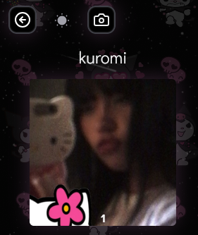

# cute linktree uwu
- uses HeroUi 
- [config file](https://raw.githubusercontent.com/xyztavo/uwulinked/refs/heads/main/config.json)
- has album to show pics n videos
- has blog posting
- supports discord activities through [lanyard](https://github.com/Phineas/lanyard)
- shows what music you're listening too in spotify
- dark mode is kuromi theme, light mode is hello kitty theme
- i made with gf, [live example](https://marikitty.vercel.app)
## usage
- go to [config file](https://raw.githubusercontent.com/xyztavo/ulinked/refs/heads/main/config.ts)
> in the config file, you can enable blog and gallery features, aswell the lanyard feat
- also change the config for the [posts](https://raw.githubusercontent.com/xyztavo/ulinked/refs/heads/main/config.gallery.ts)
- also change the config for the [albums](https://raw.githubusercontent.com/xyztavo/ulinked/refs/heads/main/config.gallery.ts)


- change all the stuff you want and you are good to go! 💞💞
```ts
const config: Config = {
  options: {
    blog: true,
    gallery: true, // this will only hide the gallery page, you can still access it by going to its respective routes.
  },
  nickname: "marikitty",
  lanyard: {
    active: true, /* if you don't wish to expose your Discord activities with lanyard, set to false */
    discordId: "1342638294961360949",
  },
  accentColor: "#fc9aee",
  avatarImgSrc: "/assets/profile.png",
  buttons: [
    {
      title: "💌 ୨♡୧ playlist da mari ✧ ˚.",
      link: "https://www.youtube.com/playlist?list=PLggpdHXCYzD8_yF2yIh2qIS83RF5SnKd0",
    },
    {
      title: "爱 minecraft textures packs  ˖ ࣪⊹ ִֶָ 🩰",
      link: "https://www.youtube.com/playlist?list=PLggpdHXCYzD9keHB7A2z8PsTKSzkd6YXV",
    },
    {
      title: "୨☆୧ makeup playlist 𝅄 🪞 𝅄 ੭",
      link: "https://www.youtube.com/playlist?list=PLggpdHXCYzD9bd1yjVUnMSjSipdoHbfeA",
    },
  ],
  instagramLink: "https://www.instagram.com/mariana.0lv/",
  discordLink: "https://discord.com/users/1342638294961360949",
  youtubeLink: "https://www.youtube.com/@luvvykkj",
  spotifyLink: "https://open.spotify.com/user/vu17cdzwl3nysuaf9w458bivs",
  footer: "made with ❤️, mari",
};
```
## screenshots



